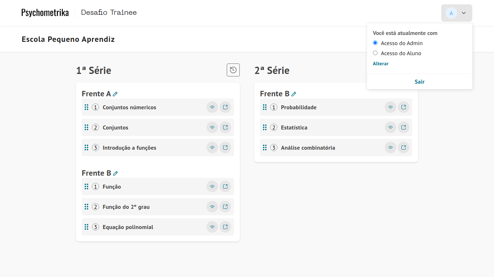

<h1>
Desafio Psychometrika
</h1>

## 💻 Como acessar o projeto

### Clique [aqui](https://psychometrika-29e1f.web.app/) para acessar a aplicação.
###  Admin:
- Email: ``admin@psychometrika.com.br``
- Senha: ``hash123``
### Aluno:
- Email ``aluno@psychometrika.com.br``
- Senha: ``hash987``

<h1></h1>

- Visão principal do projeto
<h1>
  
</h1>

<h3>Mais imagens do projeto:</h3>

- [SignIn Page](./assets-readme/signin-page.png)
- [Student Page](./assets-readme/student-page.png)

## 📃 Sobre

O projeto/desafio foi requisitado no processo seletivo da **Psychometrika**. A aplicação foi feita em **ReactJS** e tem como objetivo criar um ambiente de estudo, onde o administrador do sistema define quais capítulos do livro estarão disponíveis para o aluno e qual a sua ordem.
A aplicação é alimentada por um banco de dados **Realtime** do Firebase.

## 🚀 Tecnologias utilizadas

O projeto foi desenvolvido utilizando as seguintes tecnologias:

- [ReactJS](https://reactjs.org/)
- [SCSS](https://sass-lang.com/)
- [Typescript](https://www.typescriptlang.org/)
- [Firebase](https://firebase.google.com/)
- [React Hot Toast](https://react-hot-toast.com/) Biblioteca de notificações.
</p>

## 📥 Como baixar a aplicação

```bash
git clone https://github.com/eliezer537/Desafio-Psychometrika.git
cd Desafio-Psychometrika
```

## 📌 Configuração da aplicação
- Todas as configurações de banco de dados já estão incluidas na aplicação, assim como variáveis de ambiente. As variáveis de ambiente estarão disponíveis estritamente até o projeto ser checado pela **Psychometrika** e o processo seletivo ser finalizado.

## 📦 Para instalar as dependências
```bash
yarn install
```

## 🖱️ Para executar a aplicação

```bash
yarn start
```

Caso não tenha o **yarn** instalado em seu computador, você poderá acessar o [Guia de instalação](https://classic.yarnpkg.com/en/docs/install/#debian-stable).
